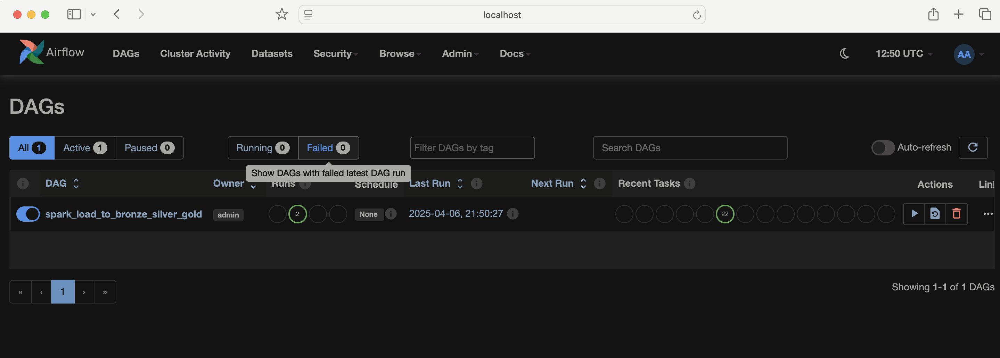
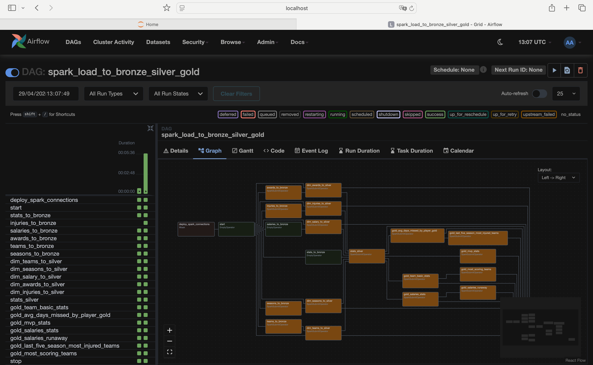
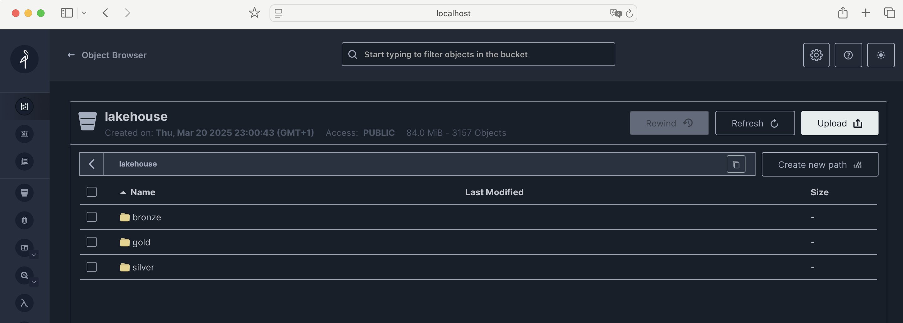
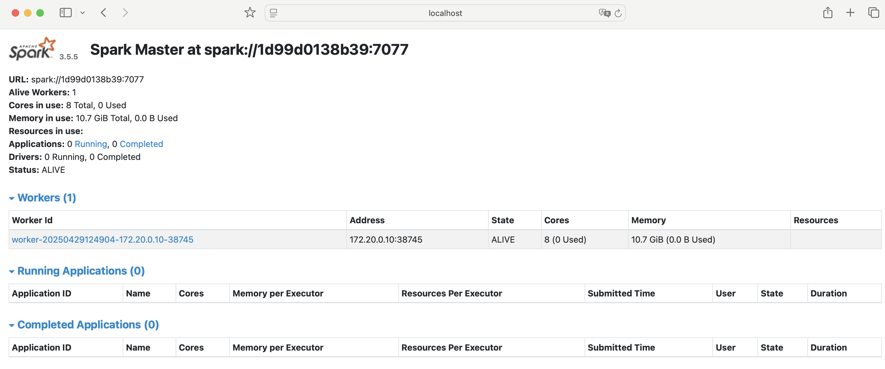
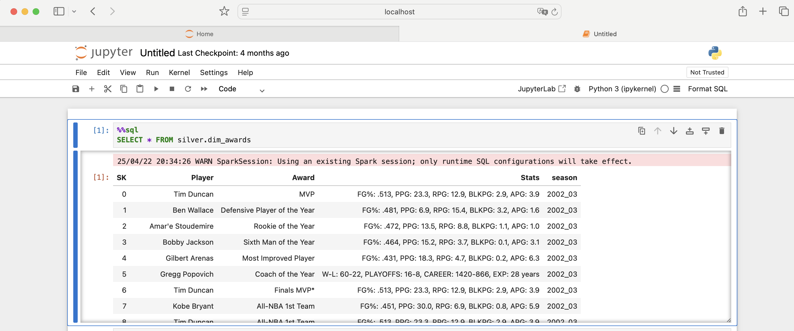
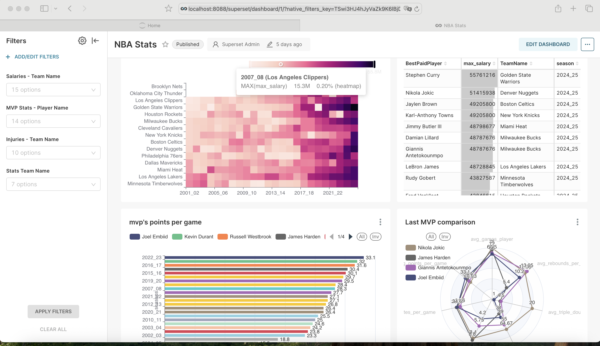
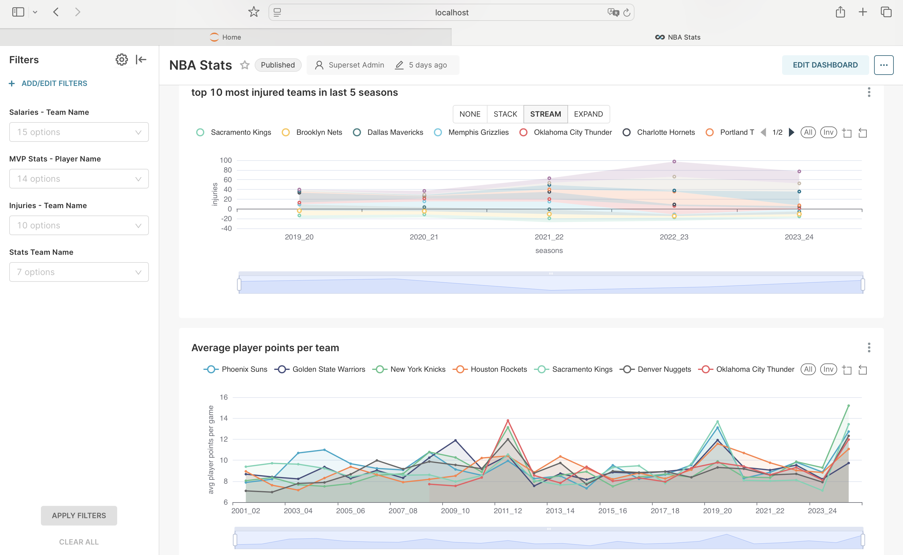
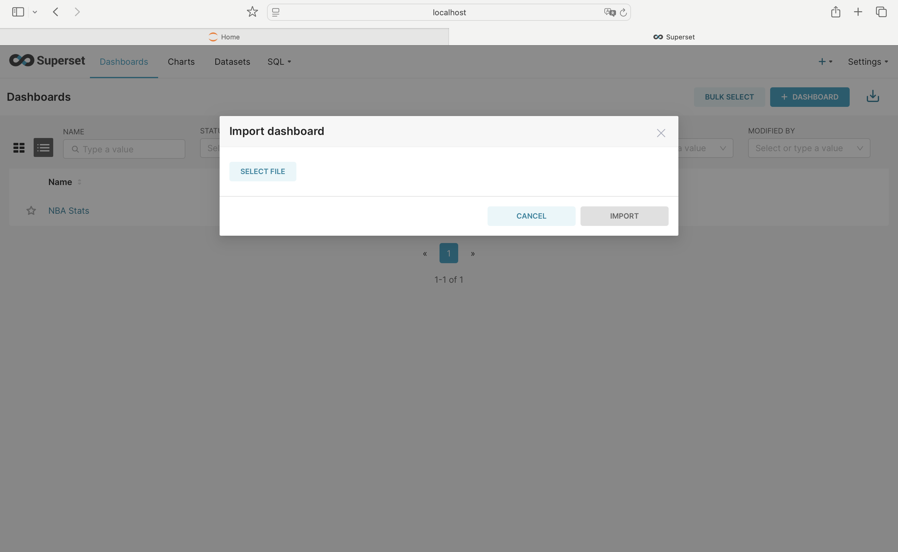

Master thesis

Analysis of the use of the Apache Iceberg format in the construction of ETL/ELT flows and the Lakehouse architecture on the example of NBA league statistical data

Prerequisites:

    - Docker installed on local machine
    - Docker compose installed om local machine

To run -> 'docker compose up' from terminal
it takes a while to pull all images

Components are available under the hosts listed below:

Airflow -> http://localhost:5050 (to login username 'airflow', password 'airflow')

MinIO -> http://localhost:9001 (login username 'admin', password 'password') 

Spark -> http://localhost:8080

Jupyter Notebook -> http://localhost:8888

SuperSet -> http://localhost:8088/superset/dashboard/1/ (path to dashboards)
(username 'admin', password 'admin')

to load dashboard go to Dashboards tab then arrow in the right top corner - 'import dashboards'
select zip file dashboard.zip from superset directory

